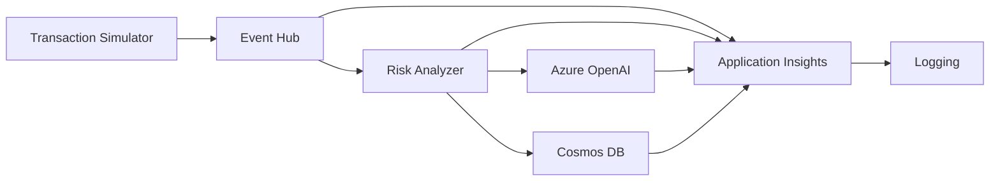

# Risk Assessment Pipeline

A real-time risk assessment pipeline using Azure Event Hub, Azure OpenAI, and Application Insights. This system processes incoming events and provides AI-powered risk analysis using LangChain and Azure OpenAI, with results stored in Cosmos DB.

## Architecture



## Prerequisites

- Python 3.8+
- Azure Subscription with:
  - Azure Event Hub namespace and hub
  - Azure OpenAI service
  - Application Insights resource
  - Cosmos DB account

## Setup

1. Clone the repository:
```bash
git clone https://github.com/yourusername/risk-assessment-pipeline.git
cd risk-assessment-pipeline
```

2. Create a virtual environment and activate it:
```bash
python -m venv venv
source venv/bin/activate  # On Windows: venv\Scripts\activate
```

3. Install dependencies:
```bash
pip install -r requirements.txt
```

4. Create a `.env` file in the root directory with the following variables:
```env
AZURE_EVENTHUB_CONNECTION_STRING=your_eventhub_connection_string
AZURE_OPENAI_API_KEY=your_api_key
AZURE_OPENAI_ENDPOINT=https://your-resource.openai.azure.com/
AZURE_OPENAI_DEPLOYMENT_NAME=your_deployment_name
APPLICATIONINSIGHTS_CONNECTION_STRING=your_appinsights_connection_string
AZURE_COSMOS_ENDPOINT=your_cosmos_endpoint
AZURE_COSMOS_KEY=your_cosmos_key
AZURE_COSMOS_DB_NAME=RiskDB
AZURE_COSMOS_CONTAINER_NAME=RiskResults
```

## Project Structure

```
risk-assessment-pipeline/
├── .env                    # Environment variables
├── requirements.txt        # Python dependencies
├── src/
│   ├── __init__.py
│   ├── config.py          # Configuration management
│   ├── ingestion/         # Event Hub integration
│   ├── analysis/          # Risk analysis logic
│   ├── monitoring/        # Telemetry and monitoring
│   ├── storage/          # Cosmos DB integration
│   ├── utils/            # Utility functions and simulators
│   └── main.py           # Application entry point
└── README.md
```

## Components

### Event Hub Client
- Handles real-time event ingestion
- Processes events asynchronously
- Maintains checkpoints for reliable message processing
- Implements retry logic for failed events

### Risk Analyzer
- Uses LangChain with Azure OpenAI for risk assessment
- Enhanced analysis considering:
  - Transaction patterns
  - User behavior
  - Geographic location
  - Time-based factors
- Provides detailed risk assessment including:
  - Risk Score (0-100)
  - Risk Level (Low/Medium/High)
  - Potential Impact
  - Recommended Actions
  - Detailed Reasoning

### Cosmos DB Storage
- Persistent storage for risk analysis results
- Document structure includes:
  - Original event data
  - Risk assessment results
  - Timestamps and metadata
  - Recommended actions

### Transaction Simulator
- Generates realistic test transactions
- Configurable transaction patterns
- Supports various transaction types and currencies
- Customizable event generation rates

### Telemetry
- Implements OpenTelemetry for monitoring
- Integrates with Azure Application Insights
- Tracks spans and performance metrics
- Monitors retry attempts and failures

## Running the Application

1. Ensure all prerequisites are met and configuration is complete

2. Run the main application:
```bash
python src/main.py
```

3. For testing, run the transaction simulator:
```bash
python src/utils/simulator.py
```

## Event Format

The pipeline expects events in JSON format with the following structure (example):
```json
{
    "event_id": "123456",
    "timestamp": "2024-03-21T10:00:00Z",
    "data": {
        "type": "transaction",
        "amount": 1000.00,
        "currency": "USD",
        "source": "web_portal",
        "user_id": "user123"
    }
}
```

## Monitoring

- Monitor the application using Azure Application Insights
- View traces, metrics, and logs in the Azure Portal
- Set up alerts based on custom metrics and thresholds

## Error Handling

The pipeline includes comprehensive error handling:
- Event processing errors are logged and don't stop the pipeline
- Failed events can be reprocessed
- Telemetry captures errors for monitoring

## Development

### Adding New Features

1. Create a new module in the appropriate directory
2. Update the main.py file to include new functionality
3. Add any new configuration to config.py
4. Update requirements.txt if new dependencies are needed

### Testing

1. Create test events in Event Hub using the Azure Portal or SDK
2. Monitor the application logs and Application Insights
3. Verify risk analysis results in the logs

## Troubleshooting

Common issues and solutions:

1. Connection Issues
   - Verify Azure credentials in .env
   - Check network connectivity
   - Ensure Azure services are running

2. Event Processing Errors
   - Check event format
   - Verify Event Hub consumer group permissions
   - Review application logs

3. OpenAI Integration Issues
   - Confirm API key and endpoint
   - Check deployment name
   - Verify quota and rate limits

## Contributing

1. Fork the repository
2. Create a feature branch
3. Commit your changes
4. Push to the branch
5. Create a Pull Request

## License

This project is licensed under the MIT License - see the LICENSE file for details.

## Support

For support, please:
1. Check the documentation
2. Review existing issues
3. Create a new issue with:
   - Clear description
   - Steps to reproduce
   - Expected vs actual behavior
   - Relevant logs